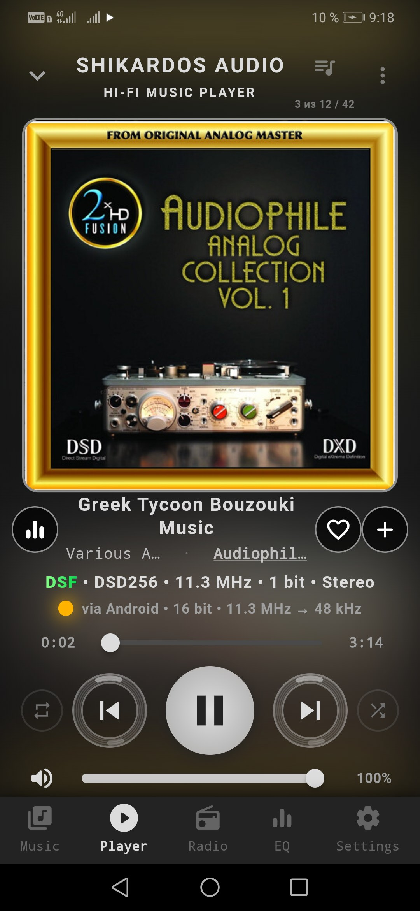
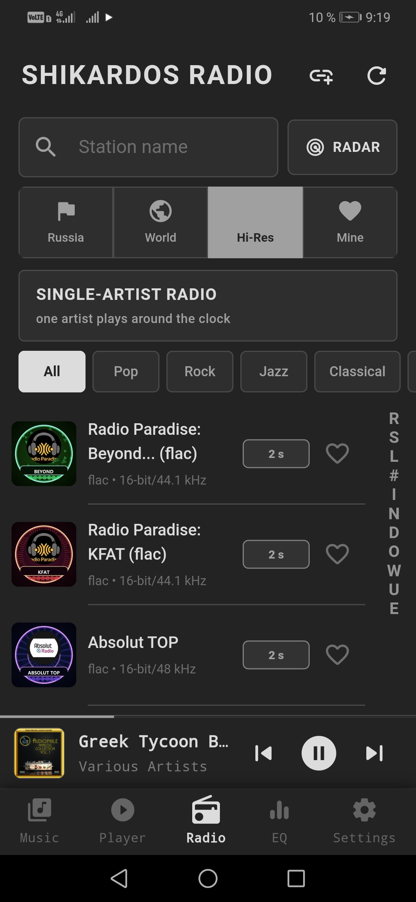
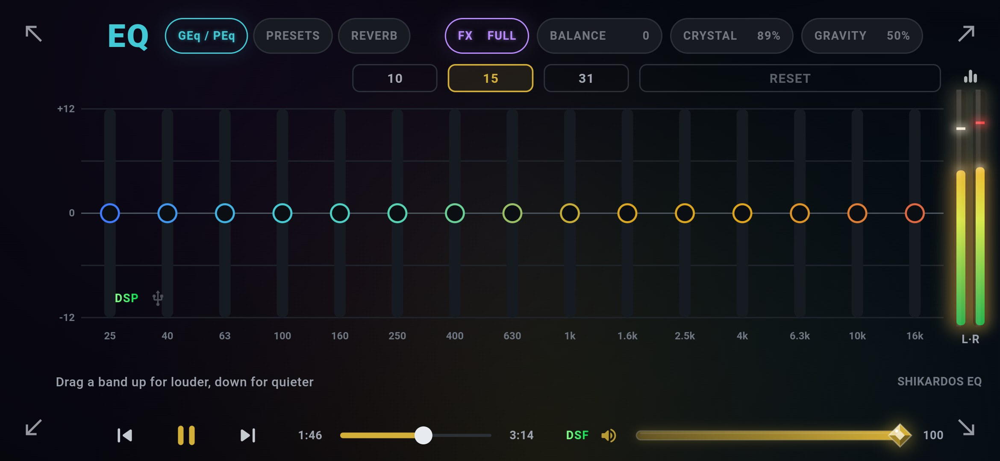

  

<h1 align="center">SHIKARDOS AUDIO</h1>

<b>A free hi‑fi music player for Android. Your phone + a small USB DAC + wired headphones = a sound system that normally costs a fortune — in your pocket.</b>

  <a href="https://github.com/89002521040g-sudo/shikardos-audio/releases/latest"><b>⬇ Download the latest APK</b></a> ·
  <a href="https://shikardos.net">shikardos.net</a>

No ads. No accounts. No subscriptions. No tracking — your music and your habits stay on your phone.
Android 8.0 and newer · 18 interface languages, English included.

---

## Why people install it

### 🎧 Bit‑perfect output to a USB DAC — without root
Android normally resamples everything on its way to a DAC. SHIKARDOS AUDIO ships its own USB audio driver (**VULAN**): the music goes straight into your DAC, bit for bit, at the file's own sample rate — 16/24/32‑bit PCM and native DSD / DoP. Volume is turned inside the DAC itself, so the music is never recalculated. The screen shows the whole **Signal path** — tap the format line under the song title to see exactly what happens to the sound from file to headphones.

### 📻 Lossless radio you didn't know existed
Most internet radio is compressed MP3. A small number of stations around the world broadcast in **FLAC** — CD quality, some even higher. They are hard to find, and almost no player collects them. We did: **164 FLAC stations**, each one listened to and checked by hand that it really is lossless inside. Plus hundreds of regular stations and 500+ "single‑artist" stations that play one musician around the clock.

### 📡 Radar: stations ranked by *your* network
The same station plays differently for different people — it depends on your carrier, Wi‑Fi and where the server stands. **RADAR** turns your phone into a measuring instrument: it knocks on every station from your own network, times the first sound, and (with **Deep check**) listens for dropouts. The list then re‑orders itself so the stations that start fastest and play steadiest *for you* are on top.

### 🎚️ Sound tools
- Parametric equalizer (a curve you drag with your finger) and a graphic one with 10 / 15 / 31 bands, ready‑made presets and your own
- **CRYSTAL** (clarity and air) and **GRAVITY** (deep bass without masking vocals)
- **AudioDNA** — a short hearing test; the player gently adapts the sound to your ears
- Loudness alignment across your whole library, a look‑ahead limiter against clipping, reverb spaces
- All of it works through the USB DAC too — and when every effect is off, the player says plainly that the sound is untouched

### 🎵 Your music, in any format
FLAC, WAV, AIFF, ALAC, APE, WavPack, TAK, DSD (DSF/DFF) and hi‑res PCM, CUE sheets that split one‑file albums into tracks, lyrics from tags and .lrc files. Browse by albums, artists, tracks or **folders**.

### ☁️ Play straight from a cloud link
Paste a public share link to a folder on Google Drive, Yandex Disk or Cloud Mail.ru — the folder opens as an album and plays without downloading anything. Hi‑res and DSD included.

### ✨ Small things that make it home
Swipe on the cover to change songs or volume · sleep timer · alarm that wakes you with your favourite radio station · volume schedule for morning and night · record a radio stream to a file · backup and transfer of settings · in‑app updates only with your consent · several looks to choose from.

---

## Screenshots

  
  

  

---

## Install

1. Open **[Releases](https://github.com/89002521040g-sudo/shikardos-audio/releases/latest)** and download the `.apk` file.
2. Open it on your phone. Android will ask whether apps may be installed from this source — allow it (this is the normal question for any app not from a store).
3. On first launch, grant access to music so the player can find your library.

Updates can be installed right inside the player: **Settings → Update**.
You can also track releases automatically with [Obtainium](https://github.com/ImranR98/Obtainium) — add this repository's URL.

**Using a USB DAC:** plug it in, allow USB access when Android asks, then turn on **VULAN** in Settings.

---

## Something not working?

Open an [issue](https://github.com/89002521040g-sudo/shikardos-audio/issues) — English is fine. It helps a lot to attach the player log: open **Settings** and tap the item with the 🐞 bug icon — the player collects a log file and offers to share it. The log contains only what the player did in the last minutes; it leaves your phone only when you share it yourself.

---

## About

Made in Arkhipo‑Osipovka, a small village on the Black Sea coast. Every station in the lossless catalogue was checked by ear, and half of the features came from listeners' requests.

This repository hosts releases and documentation; the source code is not published.

### Third‑party components
SHIKARDOS AUDIO uses the following open‑source libraries, each built as a separate shared library:

| Component | License | Notes |
|---|---|---|
| [FFmpeg](https://ffmpeg.org) 7.1.1 (libavcodec, libavformat, libavutil, libswresample) | LGPL v3 or later | Official source, no GPL parts; see [licenses/ffmpeg](licenses/ffmpeg) |
| [libusb](https://libusb.info) 1.0.27 | LGPL v2.1 or later | See [licenses/libusb](licenses/libusb) |
| [Mbed TLS](https://www.trustedfirmware.org/projects/mbed-tls/) 3.6.7 | Apache 2.0 | [licenses/mbedtls](licenses/mbedtls) |
| [Oboe](https://github.com/google/oboe) | Apache 2.0 | [licenses/oboe](licenses/oboe) |

Details and how to obtain the corresponding source code: [THIRD_PARTY_NOTICES.md](THIRD_PARTY_NOTICES.md).
